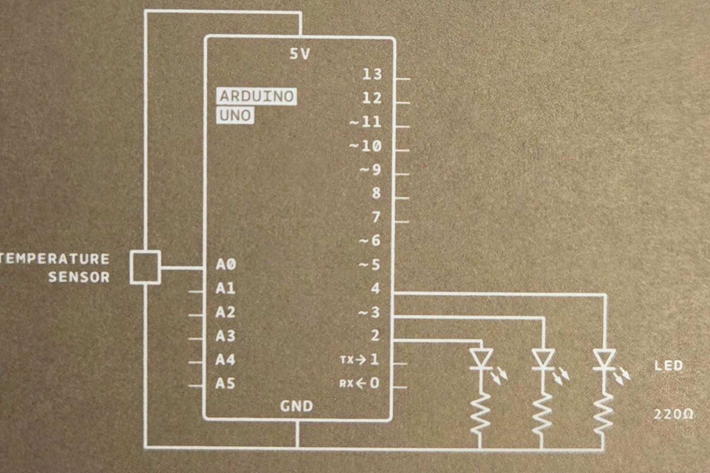
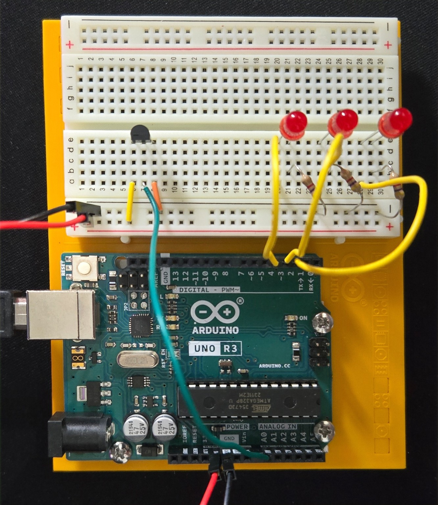
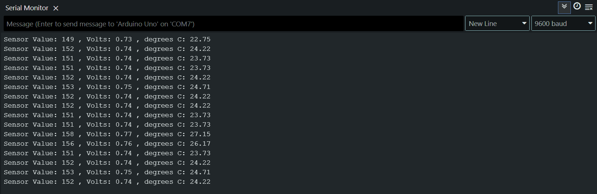
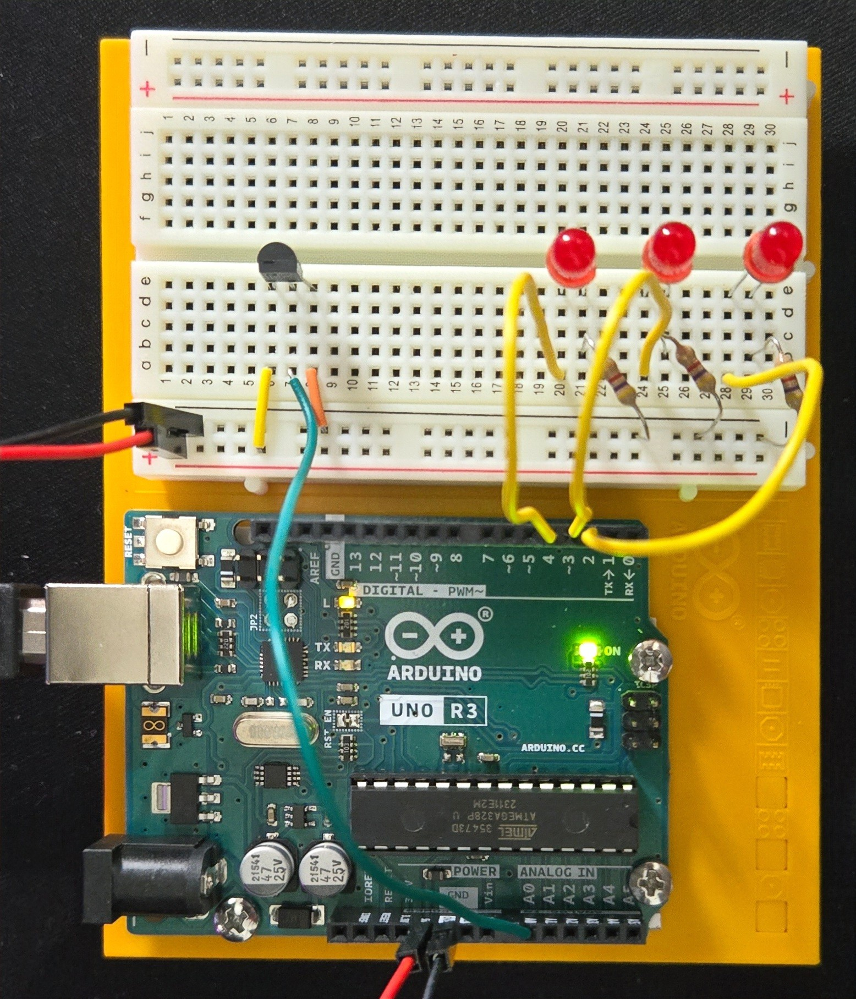
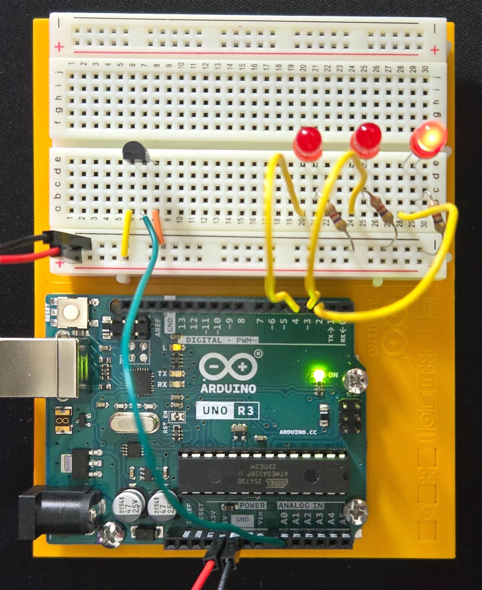
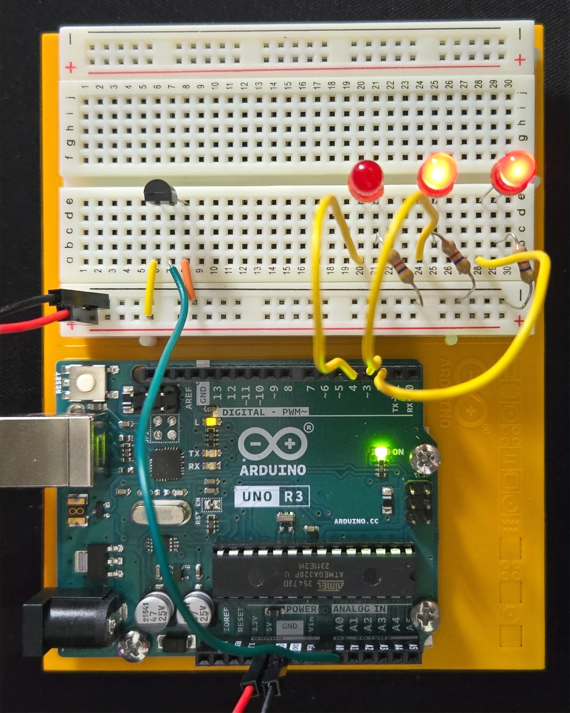
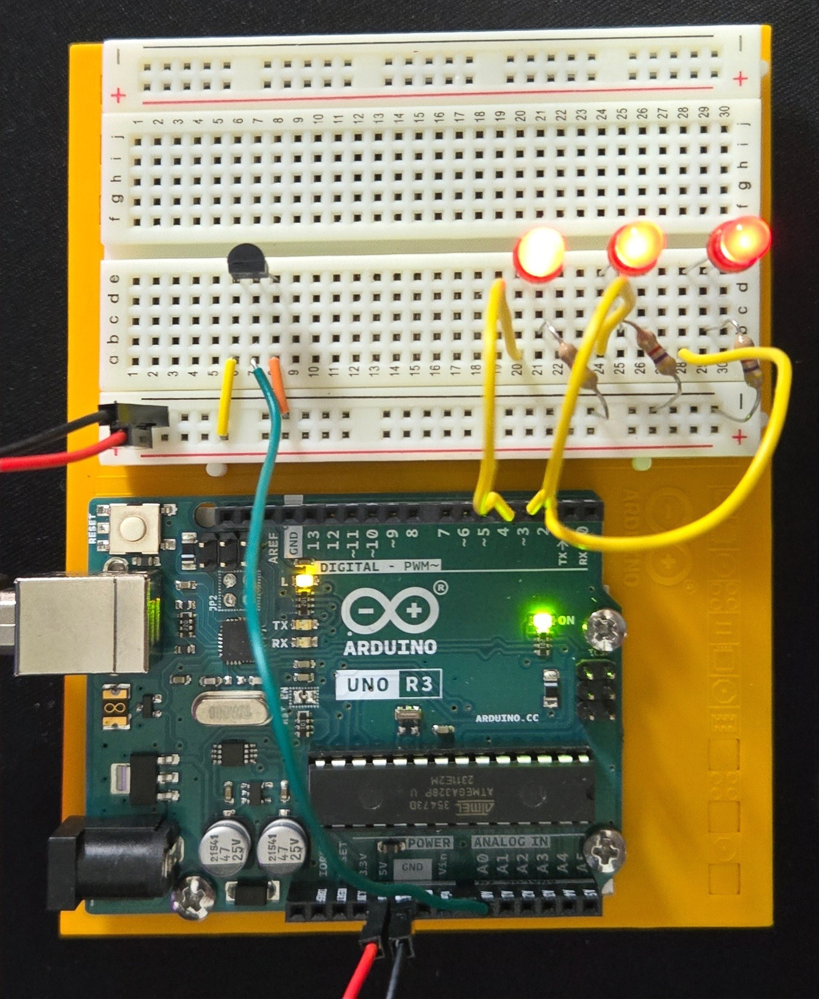

# 🌡️ Arduino UNO R3 – Temperature Sensor (Love-O-Meter)

This is a simple project using an Arduino UNO R3 and a TMP36 temperature sensor to measure temperature based on skin and air contact. The sensor sends out a variable voltage depending on the heat it detects, and the Arduino reads that value using its analog input (ADC).

The result is shown in real time using the Serial Monitor in the Arduino IDE, making it a great hands-on way to explore analog inputs and sensor data.

---

## 📚 Table of Contents

- [What You'll Need](#-what-youll-need)
- [How It Works](#-how-it-works)
- [Why This Project?](#-why-this-project)
- [Circuit Diagram & Setup](#️-circuit-diagram--setup)
- [How to Run](#️-how-to-run)
- [Pin Connections](#-pin-connections)
- [Sample Code (snippet)](#-sample-code-snippet)
- [Output Preview](#-output-preview)

---

## 🔧 What you'll need:
- Arduino UNO R3
- TMP36 temperature sensor
- Breadboard + jumper wires
- USB cable + Arduino IDE
- 3 × Red LEDs
- 3 × 220Ω resistors

---

## 🧠 How it works:

The TMP36 has three pins: one for power (VCC), one for ground (GND), and one that sends out the temperature as an analog voltage.

The Arduino reads the voltage from the sensor (connected to A0) and converts it to a temperature in Celsius.

You can view the values directly in the Serial Monitor. Depending on the temperature, different LEDs light up.

---

## 💡 Why this project?

It’s a quick and fun way to learn how analog sensors work, and a nice starting point if you're curious about temperature monitoring, wearables, or even DIY health tech.

---

## 🖼️ Circuit Diagram & Setup

### Schematic View


### Real Breadboard View


> 💡 Tip: Make sure the flat side of the TMP36 is facing you. The pinout from left to right is: **GND, Vout (to A0), VCC**.

---

## ▶️ How to Run

1. Connect the circuit as shown in the diagram.
2. Open `Temperature_Sensor-CODE.ino` in the Arduino IDE.
3. Select your Arduino board and COM port.
4. Upload the sketch.
5. Open the Serial Monitor (9600 baud) to observe temperature data.
6. Touch the sensor and see the LEDs light up according to your "warmth".

---

## 🔌 Pin Connections

| Arduino Pin | Component         |
|-------------|-------------------|
| A0          | TMP36 Output      |
| 5V          | TMP36 VCC         |
| GND         | TMP36 GND         |
| 2           | LED 1 (+)         |
| 3           | LED 2 (+)         |
| 4           | LED 3 (+)         |

---

## 💻 Sample Code (snippet)

```cpp
// Constants and Variables
const int sensorPin = A0;
const float baselineTemp = 20.0;


void setup() {
  // Initialize the serial port to the desired speed
  Serial.begin(9600);

  // Initialize the digital pin directions and turn off
  for(int pinNumber = 2; pinNumber < 5; pinNumber++){
    pinMode(pinNumber, OUTPUT);
    digitalWrite(pinNumber, LOW);
  }
}

void loop() {
  // Read the temperature sensor
  int sensorVal = analogRead(sensorPin);

  // Send the temperature sensor values to the computer
  Serial.print("Sensor Value: ");
  Serial.print(sensorVal);

  // Convert sensor reading to voltage
  float voltage = (sensorVal/1024.0) * 5.0;
  Serial.print(" , Volts: ");
  Serial.print(voltage);
  
  // Convert the voltage to temperature and send the value to the computer
  Serial.print(" , degrees C: ");
  float temperature = (voltage - .5) * 100;
  Serial.println(temperature);

  if(temperature < (baselineTemp + 2)){ // Turn off LEDs for a LOW temperature
    digitalWrite(2, LOW);
    digitalWrite(3, LOW);
    digitalWrite(4, LOW);
  }else if(temperature >= (baselineTemp + 2) && temperature < (baselineTemp + 4)){ // Turn on one LED for a LOW temperature
    digitalWrite(2, HIGH);
    digitalWrite(3, LOW);
    digitalWrite(4, LOW);
  }else if(temperature >= (baselineTemp + 4) && temperature < (baselineTemp + 6)){ // Turn on two LEDs for a MEDIUM temperature
    digitalWrite(2, HIGH);
    digitalWrite(3, HIGH);
    digitalWrite(4, LOW);
  }else if(temperature >= (baselineTemp + 6)){ // Turn on three LEDs for a high temperature
    digitalWrite(2, HIGH);
    digitalWrite(3, HIGH);
    digitalWrite(4, HIGH);
  }

  delay(2500);
  
}
```

## 📤 Output Preview

### 🔢 Serial Monitor Output

The following screenshot shows live temperature data being printed to the Serial Monitor:



Each line shows:
- Raw sensor value
- Calculated voltage
- Converted temperature in °C

### 🔦 LED Response by Temperature

| Temperature Range       | LED State           | Photo |
|-------------------------|---------------------|-------|
| < 22°C                  | All OFF             |  |
| 22°C - 24°C             | LED 1 ON            |  |
| 24°C - 26°C             | LED 1 & 2 ON        |  |
| ≥ 26°C                  | All LEDs ON         |  |

---
